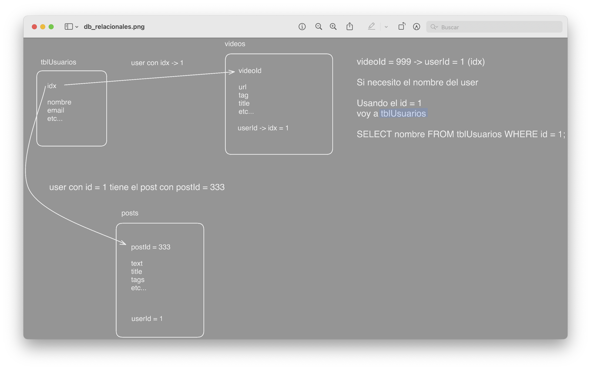

# SQL y MySQL

[Teoría en W3Schools](https://www.w3schools.com/sql/)

## Documentación

[Tipos de datos](https://dev.mysql.com/doc/refman/8.0/en/data-types.html)

## Ejercicios de SQL

[Ejercicios de MySQL](https://parzibyte.me/blog/2018/02/06/ejercicios-resueltos-consultas-sql-mysql/amp/)

Ejercicios por bloques:

- [Bloque 1](1.bloque1.sql)
- [Bloque 2](2.bloque2.sql)
- [Bloque 3](3.bloque3.sql)
- [Bloque 4](4.bloque4.sql)

## Más Ejercicios

- [Parte 1 - SELECT (es lo anterior)](https://parzibyte.me/blog/2018/02/06/ejercicios-resueltos-consultas-sql-mysql/)
- [Parte 2 - teoría UPDATE y DELETE](https://parzibyte.me/blog/2018/02/12/ejercicios-mysql-cadena-update-delete/)
- [Parte 3 - teoría de algunas funciones](https://parzibyte.me/blog/2018/02/23/mas-ejercicios-resueltos-mysql-combinando-funciones/)
- [Parte 4 - Fechas](https://parzibyte.me/blog/2020/12/28/ejercicios-resueltos-mysql-4/)

## Creación de base de datos

Ejecutamos estos queries: [crear base de datos](0.crear_db.sql)

## Diagramas
Esquema de relaciones entre tablas en una base de datos relacional.

Esquema de flujo de datos en una aplicación web.
