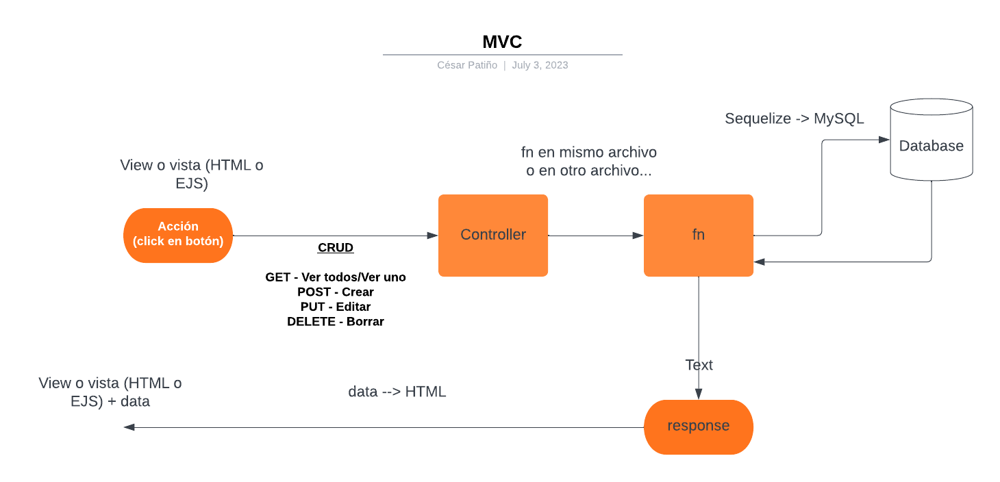

## Ejemplo de app con Express

Seguimos los pasos de [este tutorial](https://medium.com/@onejohi/building-a-simple-rest-api-with-nodejs-and-express-da6273ed7ca9)

Para crear el `package.json` con los valores por defecto:
```
npm init -y 
```
Si queremos editar cada uno de los valores, usamos:
```
npm init
```
---
Para instalar express y añadirlo al `package.json`:
```
npm install --save express
```
También se puede usar `-S` en lugar de `--save`

## Nodemon
Para instalar nodemon:
```
npm install -g nodemon
```
Esta instalación es global porque queremos usar nodemon para monitorizar los cambios en los ficheros de la aplicación y reiniciar el servidor automáticamente.

## Referencias
- [Temas de Express](https://www.tutorialspoint.com/expressjs/index.htm)

Para instalar un paquete globalmente:
```
npm -g install <nombre_del_paquete>
```

## Proyectos
[1.CRUD_sin_db](1.CRUD_sin_db.md) Proyecto con un CRUD sin base de datos usando Express
  - GET, POST, PUT, DELETE 
  
[2.tutorial](2.tutorial/) Seguimos el tutorial de [Tutorialspoint](https://www.tutorialspoint.com/expressjs/index.htm) hasta el tema de Middlewares. 
  - GET, POST, PUT, DELETE
  - Router de Express
  - Responses en HTML y JSON 
  - Middlewares
  - Cookies
  - HTML y Forms

[3.ejs](3.ejs/) Primero, seguimos este tutorial de [Digital Ocean](https://www.digitalocean.com/community/tutorials/how-to-use-ejs-to-template-your-node-application). Rehacemos parte del proyecto 2 pero usando un lenguaje de plantilla
  - Extensión EJS para Code: `DigitalBrainstem.javascript-ejs-support`

[4.forms-ejs](4.forms-ejs/) Formulario con lenguaje de plantilla EJS. [Tutorial EJS en Digital Ocean](https://www.digitalocean.com/community/tutorials/how-to-use-ejs-to-template-your-node-application)

[5.sequelize](5.sequelize/) Implementamos Sequelize para crear tablas y hacer CRUD. [Tutorial en Digital Ocean](https://www.digitalocean.com/community/tutorials/how-to-use-sequelize-with-node-js-and-mysql)

