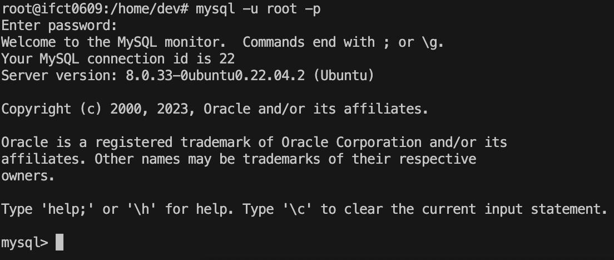

## Comandos de MySQL en Terminal

Para entrar a la base de datos, en terminal:
```bash
  mysql -u root -p
```

Escribir contraseña (no se ven los caracteres) y Enter.

---
Para ver todas las tablas actuales:
```sql
SHOW DATABASES;
```
Salida:
```
+--------------------+
| Database           |
+--------------------+
| information_schema |
| mysql              |
| performance_schema |
| sys                |
+--------------------+
```
Creamos base de datos:
```sql
CREATE DATABASE nombre_db;
```
Seleccionamos base de datos:
```sql
USE nombre_db;
````
Mostrar tablas de db:
```sql
SHOW TABLES;
```
Creamos tabla de ejemplo:
```sql
CREATE TABLE nombre_tabla (`id` INT NOT NULL AUTO_INCREMENT , `nombre`
VARCHAR(50) NOT NULL , `email` VARCHAR(100) NOT NULL , PRIMARY KEY (`i
d`)) ENGINE = InnoDB;
```
```sql
SHOW TABLES;
```
Salida:
```
+-----------------+
| Tables_in_cesar |
+-----------------+
| temp            |
+-----------------+
```
Vemos la definición de la tabla:
```sql
DESCRIBE nombre_tabla;
```
Salida:
```
+--------+--------------+------+-----+---------+----------------+
| Field  | Type         | Null | Key | Default | Extra          |
+--------+--------------+------+-----+---------+----------------+
| id     | int          | NO   | PRI | NULL    | auto_increment |
| nombre | varchar(50)  | NO   |     | NULL    |                |
| email  | varchar(100) | NO   |     | NULL    |                |
+--------+--------------+------+-----+---------+----------------+
```
Insertamos datos en esta tabla:
```sql
INSERT INTO nombre_tabla 
  (`id`, `nombre`, `email`) 
  VALUES 
  (NULL, 'pepe', 'pepe@larana.frog'), 
  (NULL, 'María', 'maria@gmail.com')
```
Para ver los datos, hacemos un SELECT:
```sql
SELECT * FROM nombre_tabla;
```
Salida:
```
+----+--------+------------------+
| id | nombre | email            |
+----+--------+------------------+
|  1 | pepe   | pepe@larana.frog |
|  2 | María  | maria@gmail.com  |
+----+--------+------------------+
```